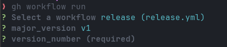

# Pubstack Actions

Github actions to initialize various environments.

## How to release
### Automatically (recommended)

#### By CLI
With gh cli, you can run `gh workflow run` then you will be prompted to fill the inputs.
.


#### By UI
1. Go to [release](https://github.com/pbstck/actions/actions/workflows/release.yml)
2. Click on `Run workflow`
3. Fill the `Release version number` with the next minor version (e.g. `v1.1`)
4. Click on `Run workflow`


### Manually

```
    git tag v1.X
    git tag -fa v1 -m "Update v1 tag"
    git push origin v1.X
    git push origin v1 --force 
```

Replace X by the next minor version

## Create Repository

### Description
Will create a repository in `pbstck` organization. This repository will be private.
This action uses [pbstck/template](https://github.com/pbstck/template) as a template for the new repository
It will also apply some default rules :
- protect the main branch to enforce review
- create 3 env: dev, beta, prod
- protect the prod environment to ask for review deployment from the "dev" team
- allow only squash and merge in PR
- Delete automatically branches after merge


### Usage

```yaml
name: Create repository

on:
  workflow_dispatch:
    inputs:
      name:
        description: 'Name'
        required: true
      description:
        description: 'Descriptionn'
        required: false

env:
  GITHUB_TOKEN: ${{ secrets.ORG_SECRET }}
jobs:
  create-repo:
    runs-on: ubuntu-latest
    steps:
      - uses: actions/checkout@v4
      - uses: pbstck/actions/create-repository@v1
        with:
          name: ${{ inputs.name }}
          description: ${{ inputs.description }}
```

## Get Stage
### Description
Returns the environment depending on the current GITHUB_REF
It follows theses rules:
  - If the branch name is main or master => dev
  - If it's a tag with format YYYY-MM-DDTHH-mm-SSZ-beta => beta
  - If it's a tag with format YYYY-MM-DDTHH-mm-SSZ-prod => prod
### Usage
```yaml
  get_stage:
    outputs:
      target_env: ${{ steps.get_current_stage.outputs.target_env }}
    runs-on: ubuntu-latest
    steps:
      - uses: pbstck/actions/get-stage@v1
        id: get_current_stage
```

## Setup Cloud
### Description
It login to Gsuite artifactory and AWS CLI

### Usage
`- uses: pbstck/actions/setup-cloud@v1`

Make sur you have those environment variables (please use Secrets for storing them):
```yaml
env:
  AWS_DEFAULT_REGION: "eu-west-1"
  AWS_ACCESS_KEY_ID: ${{ secrets.CICD_TOOLING_FULL_ACCESS_KEY }}
  AWS_SECRET_ACCESS_KEY: ${{ secrets.CICD_TOOLING_FULL_ACCESS_SECRET }}
  CICD_ARTIFACTORY_KEY: ${{ secrets.CICD_ARTIFACTORY_KEY }}
```
## Setup Go
### Description
Install go with the desired version and cache go mod.
Caches the following directories:
- `~/.cache/go-build`
- `~/go/pkg/mod`

### Usage
```yaml
- uses: pbstck/actions/setup-go@v1
  with:
   go-version: '1.14.2'
```

## Setup Rust
### Description
Install Rust with the desired version and cache rust and target's project
You can specify the version with an input `rust-version`. If It's not provided there's a default values : `1.53.0`
Caches the following directories:
* `~/.cargo/bin/`
* `~/.cargo/registry/index/`
* `~/.cargo/registry/cache/`
* `~/.cargo/git/db/`
* `target/`

### Usage
```yaml
- name: Setup Rust
  uses: pbstck/actions/setup-rust@v1
    with:
    rust-version: '1.53.0'
```
## Setup Yarn
### Description
Install nodejs and yarn with the desired version and cache yarn's cache and node_module's project.
You can specify the version with an input `node-version`. If It's not provided there's a default values : `14.x`

### Usage
```yaml
- uses: pbstck/actions/setup-yarn@v1
```

## Coverage
### Description
Read all the summary input files and create a comment on current PR with extracted results.
You have one output for each summary input file, each represent an SVG version of a badge with the result.
Each line of the input must be formatted like `<title>@<key>@<file path>`.

* title: The title of the module that will be used in the generated badge
* key: A key that will be used to read the output
* file path: The summary file generated by the coverage tool of the tested repository

The comment output will be

| Module | Coverage on Main    | Coverage on PR                       |
|--------|---------------------|--------------------------------------|
| title  | "badge from master" | "coverage calculated from file path" |


If we are on main branch, save the SVG version of the badge in `badges/<badge-name>.svg` in the branch `coverage` of the same repository.

### How it works

In our projects, we need to use actions/coverage

This action : 
1. download the artefacts
2. comment-coverage
3. publish-badge (internally this action use write-badge)

### Usage
```yaml
  test:
    runs-on: ubuntu-latest
    needs: [test-go, test-js, test-rust]
    steps:
      - uses: pbstck/actions/coverage@v1
        with:
          summaries: |
            'Go module@go@./total-coverage'
            'Refresh Module@refresh-module@./coverage/coverage-summary.json'
            'AWS Lib@rust-common@./code/rust/common/cobertura.xml'
```

## Build output
### Description
Reads all directories in input and creates a comment on the current PR with information about file sizes (raw and compressed: gz + br).

Each line of the input must be formatted like `<baseDir>@<regex>`.

* baseDir: the base directory to check files 
* regex: an optional regex to match file inside the directory :warning: it should match only one file (useful for cases like `index-[hash].js` where the hash changes for each build or PR)

The comment output will be like:

| File                                                                                            | Old size                                                                                      | New size                                                                                 | Diff                                                                                                                                                                  |
|-------------------------------------------------------------------------------------------------|-----------------------------------------------------------------------------------------------|------------------------------------------------------------------------------------------|-----------------------------------------------------------------------------------------------------------------------------------------------------------------------|
| frontend/dist/assets/index-azerty.js<br>:arrow_right:<br>frontend/dist/assets/index-8oL-a8HI.js | Raw:&nbsp;1.53 MB<br>Gz:&nbsp;&nbsp;&nbsp;&nbsp;434 kB<br>Br:&nbsp;&nbsp;&nbsp;&nbsp;632 kB   | Raw:&nbsp;1.73MB<br>Gz:&nbsp;&nbsp;&nbsp;&nbsp;534kB<br>Br:&nbsp;&nbsp;&nbsp;&nbsp;432kB | Raw:&nbsp;+200kB&nbsp;(+13.05% :warning:)<br>Gz:&nbsp;&nbsp;&nbsp;&nbsp;+100kB&nbsp;(+23.06% :warning:)<br>Br:&nbsp;&nbsp;&nbsp;&nbsp;-200kB&nbsp;(-31.62% :warning:) |
| :new: frontend/dist/index.html                                                                  | Raw:&nbsp;0b<br>Gz:&nbsp;&nbsp;&nbsp;&nbsp;0b<br>Br:&nbsp;&nbsp;&nbsp;&nbsp;0b                | Raw:&nbsp;1.74kB<br>Gz:&nbsp;&nbsp;&nbsp;&nbsp;822B<br>Br:&nbsp;&nbsp;&nbsp;&nbsp;582B   | Raw:&nbsp;-1.74kB&nbsp;(+100% :warning:)<br>Gz:&nbsp;&nbsp;&nbsp;&nbsp;-1.74kB&nbsp;(+100% :warning:)<br>Br:&nbsp;&nbsp;&nbsp;&nbsp;-1.74kB&nbsp;(+100% :warning:)    |
| :x: frontend/dist/Pubstack_Logo.svg                                                             | Raw:&nbsp;3.02 kB<br>Gz:&nbsp;&nbsp;&nbsp;&nbsp;1.24 kB<br>Br:&nbsp;&nbsp;&nbsp;&nbsp;1.03 kB | Raw:&nbsp;0b<br>Gz:&nbsp;&nbsp;&nbsp;&nbsp;0b<br>Br:&nbsp;&nbsp;&nbsp;&nbsp;0b           | Raw:&nbsp;-3.02kB&nbsp;(-100% :warning:)<br>Gz:&nbsp;&nbsp;&nbsp;&nbsp;-3.02kB&nbsp;(-100% :warning:)<br>Br:&nbsp;&nbsp;&nbsp;&nbsp;-3.02kB&nbsp;(-100% :warning:)    |

If we are on main branch, saves the files information `files.json` in the branch `build-output` of the same repository (used as the `Old` data for PR in order to compare).

### How it works

In our projects, we need to use `actions/build-output`

This action :
1. comments
2. publishes (internally this action uses actions/build-output/write)


### Usage
```yaml
  build-output:
    runs-on: ubuntu-latest
    needs: [REPLACE_ME] #depends on build stages
    steps:
      - name: Download artifacts
        uses: actions/download-artifact@v4
        with:
          name: REPLACE_ME # Replace with your artifact name from build stage
          path: REPLACE_ME # The directory where the artifact will be downloaded to 
      - id: build-output
        uses: pbstck/actions/build-output@v1
        with:
          files: |
            path/to/aDirectoryCheckOneFile@assets/index-(.*?)\.js
            path/to/anotherDirCheckAllFiles
```